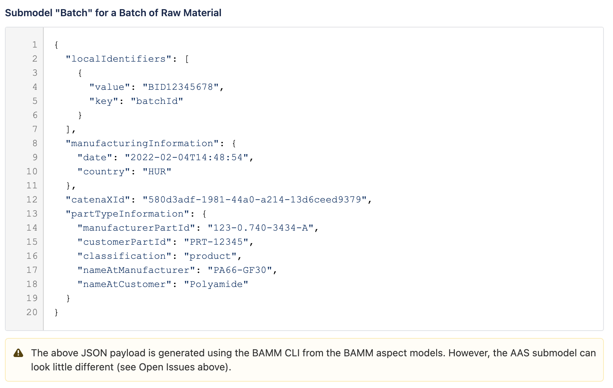

 # Batch (SDE Maven module)
---
## Description

This module use for Batch submodel specification and descriptors. It's contain the codes related to Batch to validate, parse and transfer data for DigitalTwins and EDC to create aspect twins and data offer.

---
#### Version: 1.0.0
#### Batch Aspect Model URN: urn:bamm:com.catenax.batch:1.0.0#Batch
#### Semantic Id: urn:bamm:com.catenax.batch:1.0.0
---

### Schema

Please find below links for schema details:

- https://portal.int.demo.catena-x.net/semantichub/urn%3Abamm%3Aio.catenax.batch%3A1.0.0%23Batch
- blob:https://portal.int.demo.catena-x.net/10dadf03-8062-4369-87c8-6f8f570df2c4
- https://github.com/catenax-ng/product-dft-backend/blob/modules-branch/modules/sde-submodules/batch/src/main/resources/batch.json

### CSV file headers

| Headers Name       	       		| Mandatory                     	| Position 	|
|-------------------------------		|-----------------------------	|--------	|
| uuid		                   		| No		             		    |    1     	|
| batch_id					   		| Yes					      	|    2    	|
| manufacturing_date    				| Yes 							| 	 3	   	|
| manufacturing_country  	    		| No                           	| 	 4	  	|
| manufacturer_part_id 		      	| Yes                           	| 	 5	  	|
| customer_part_id		    		 	| No                     		| 	 6	 	|
| classification		 				| Yes                           	|    7 	 	|
| name_at_manufacturer	 			| Yes                           	|    8 	 	|
| name_at_customer	 				| No                           	|    9 	 	|
| optional_identifier_key	 		| No                           	|    10 	 	|
| optional_identifier_value			| No                           	|    11 	 	|

#### [CSV Sample File Link]

#### Example for submodel Batch
    

### Work Flow 

 - CSV to POJO
 - CSV column validation and mandatory field validation
 - POJO TO DTO
 - UUID generate v4
 - DigitalTwins API's calls 
 - EDC API's calls
 - DB Store
 
### External Services Call

 - DigitalTwins
 - EDC Connectors
 
[CSV Sample File Link]: src/main/resources/batch.csv
