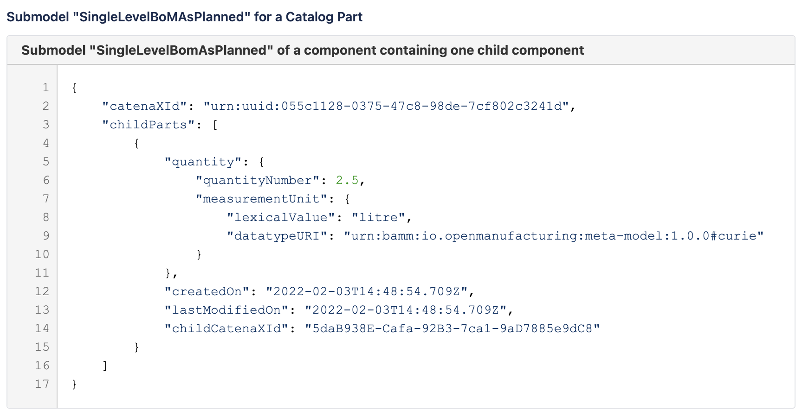

 # SingleLevelBomAsPlanned (SDE Maven module)
---
## Description

This module use for SingleLevelBomAsPlanned submodel specification and descriptors. It's contain the codes related to SingleLevelBomAsPlanned to validate, parse and transfer data for DigitalTwins and EDC to create aspect twins and data offer.

---
#### Version: 1.0.1
#### SingleLevelBomAsPlanned Aspect Model URN: urn:bamm:io.catenax.single_level_bom_as_planned:1.0.1#SingleLevelBomAsPlanned
#### Semantic Id: urn:bamm:io.catenax.single_level_bom_as_planned:1.0.1
---

### Schema

Please find below links for schema details:

- https://portal.int.demo.catena-x.net/semantichub/urn%3Abamm%3Aio.catenax.single_level_bom_as_planned%3A1.0.1%23SingleLevelBomAsPlanned
- blob:https://portal.int.demo.catena-x.net/e565320b-0153-4554-ba5c-9673962c0097
- https://github.com/catenax-ng/product-dft-backend/blob/modules-branch/modules/sde-submodules/single-level-bom-as-planned/src/main/resources/single-level-bom-as-planned.json

### CSV file headers

| Headers Name       	       		| Mandatory                     	| Position 	|
|-------------------------------		|-----------------------------	|--------	|
| parent_uuid                   		| Yes		             	    |    1     	|
| parent_manufacturer_part_id   		| Yes					      	|    2    	|
| uuid 			     				| Yes 							| 	 3	   	|
| manufacturer_part_id  	       		| Yes                           	| 	 4	  	|
| customer_part_id 		      		| No                           	| 	 5	  	|
| quantity_number    		 		| Yes                     		| 	 6	 	|
| measurement_unit_lexical_value	 	| Yes                           	|    7 	 	|
| datatype_uri	 					| Yes                           	|    8 	 	|
| created_on	 						| Yes                           	|    9 	 	|
| last_modified_on	 				| No                           	|    10 	 	|

#### [CSV Sample File Link]

#### Example for submodel SingleLevelBomAsPlanned

    

### Work Flow 

 - CSV to POJO
 - CSV column validation and mandatory field validation
 - POJO TO DTO
 - Lookup parent UUID and child UUID
 - DigitalTwins API's calls 
 - EDC API's calls
 - DB Store
 
### External Services Call

 - DigitalTwins
 - EDC Connectors
 
[CSV Sample File Link]: src/main/resources/SingleLevelBoMAsPlanned.csv
